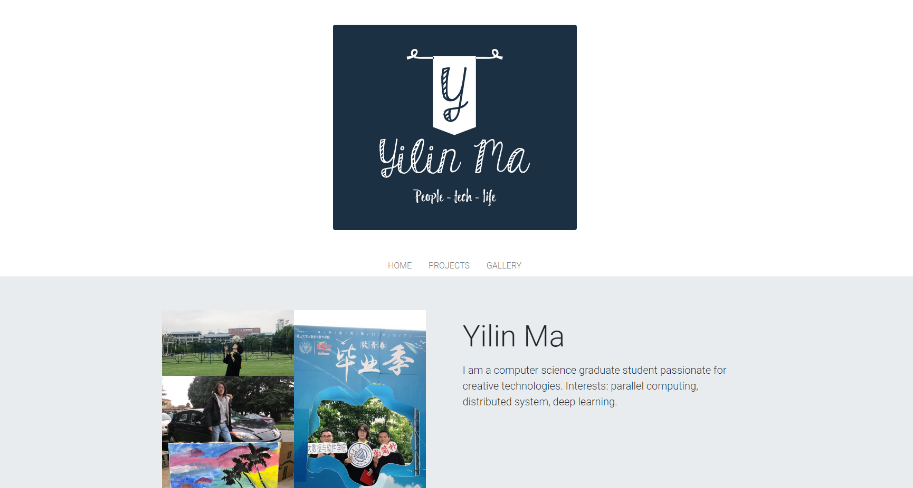

# Yilin-Ma-personal-web-page
My personal web page

Published at: https://martinma28.github.io/Yilin-Ma-personal-web-page/

## Author
Yilin ma

## Course Link
https://johnguerra.co/classes/webDevelopment_fall_2020/

## Project Objective
Introduce some **fun facts** about me publicly. It doesn't cover education background and work experience because they are not fun. While, if you do care about them, please go check this. https://www.linkedin.com/in/yilin-ma-298022161/

## Screenshot

## Build Instructions
It's a static website. So no need to build.